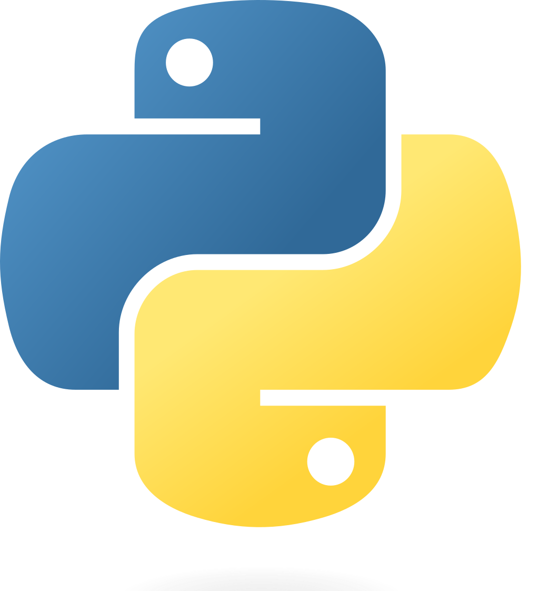

Welcome to {{cookiecutter.project_name}}!

> *{{ cookiecutter.project_short_description }}*

## What Next

To get going quickly head over to the [Quick Start](quickstart.md) tutorial, then check out the [User Guide](user-guide/index.md) for more information. Developers should check out the [Developer Guide](dev-guide/index.md) for even more detailed information and advice on how to extend {{cookiecutter.project_name}}.

The [Glossary](glossary.md) lists terms and nomenclature used in the package and in this documentation.

## Acknowledgements
Thanks to the bus driver.

To insert a picture that is resized, use html:

*Above: Python is great.*
